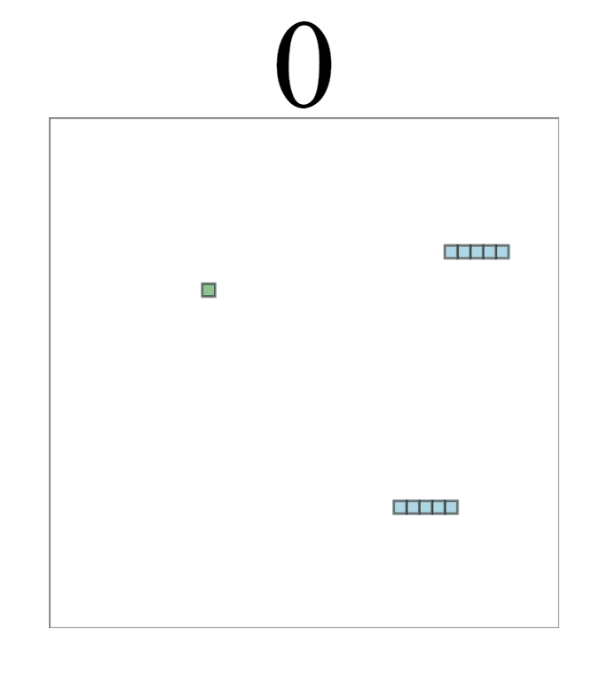
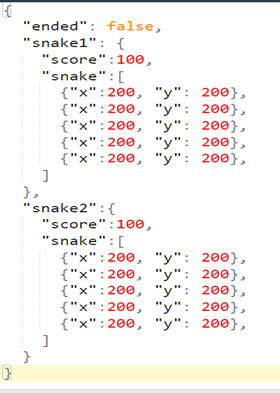
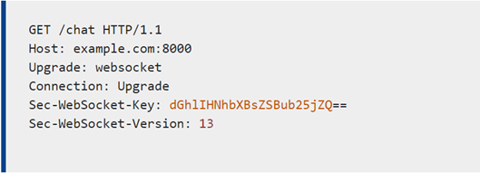
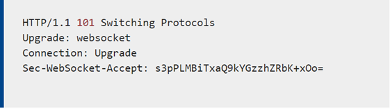
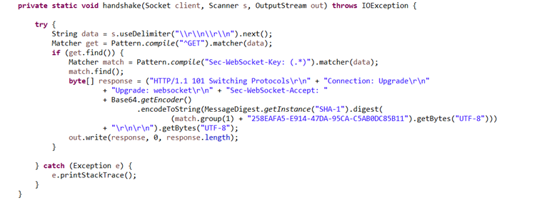
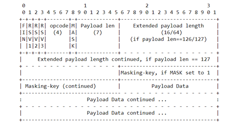
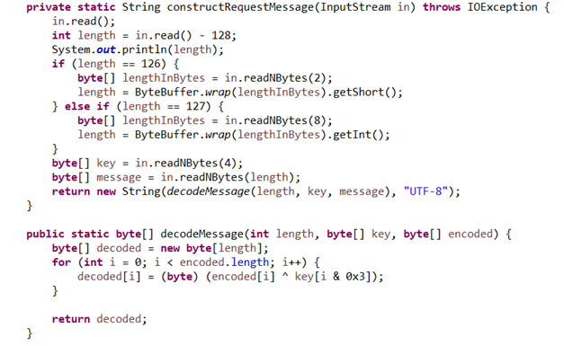

# 2-person snake game
2-person game with HTML/CSS/JavaScript client and Java WebSocket Server



## Usage

Change the value of the IP variable in line 26 of the WebPage/snakeclient.html, to the IP address of the host machine where you are running the server. After that run:

```
java -jar MultiThreadWebSocket.jar
```
Once the server is running, open the snakeclient.html on 2 different machines and start playing. The game will stop if you bump into each other or when one of the players reaches 200 points.


## Introduction/Overview 

The goal of the project was to make a snake game that would allow for 2 people to play together through a server written in Java and from 2 different host machines. Simple web page was modified and written in HTML/CSS/JS to make use of WebSocket. The server application is written in Java and communicates with web page using web socket.

## System Architecture

In 2-person snake game there are 2 clients and 1 server. Clients send a frame with snake&#39;s position and score and in return server sends back the coordinates of the food and snake of the other client. 2-person snake game runs on application layer of the TCP/IP protocol stack as it uses initial HTTP protocol to establish connection and convert it into WebSocket protocol. Before that connection is established however the server opens a TCP socket and establishes connection with the client over a three-way handshake. This handshake is happening to establish a transport layer between the processes on two hosts machines. Once that connection is established the client uses that connection to send initial HTTP request. The HTTP request is then converted to bi-directional WebSocket protocol connection. After the WebSocket connection is established, the client/server begin sending the JSON objects/strings to each other with snake position and score. The JSON objects look like in Figure 1. For client to server frame, the object is similar, but contains only one snake information from the client. Both client and server parse the strings to get data and then process the received data to send back another stringified JSON object.



_Figure 1 JSON Frame_

## System Implementation

The goal of this project was to attempt to connect web page to the server using web socket. Being familiar with web technologies, it was a good practice and deepened my understanding.

Server is written in Java and consists of 4 classes: `Snake`, `Food`, `MultiThreadWebSocket` and `serveSnake`. Snake and Food classes have methods and fields related to the information of their x and y position. `MultiThreadWebSocket` class starts 2 threads that execute serveSnake class. The server code is run mostly on serveSnake.

_Handshake_

The first thing that is done in `serveSnake` class is the handshake between client and the server. The client sends an HTTP GET request to the server and the server needs to generate a response that upgrades the connection to WebSocket. To understand how this happens I researched MDN Web Docs and the description of a WebSocket protocol provided by IETF in December 2011. The source are cited at the end of this document. The initial HTTP request is presented in figure 2.



_Figure 2 HTTP GET Request_

It is standard, except for Sec-WebSocket-Key header. This value is necessary in the server response to the original GET request. The server response headers are presented in Figure 3.



_Figure 3 Server&#39;s response (Switching Protocols)_

The server response is a special response that tells client that from now on the connection switches to using WebSocket protocol rather than HTTP. The Sec-WebSocket-Accept is constructed from Sec-WebSocket-Key header received on the client. The MDN Web Docs(source below) describes this process as follows: &quot;The Sec-WebSocket-Accept header is important in that the server must derive it from the [Sec-WebSocket-Key](https://developer.mozilla.org/en-US/docs/Web/HTTP/Headers/Sec-WebSocket-Key) that the client sent to it. To get it, concatenate the client&#39;s Sec-WebSocket-Key and the string &quot;258EAFA5-E914-47DA-95CA-C5AB0DC85B11&quot; together (it&#39;s a &quot;[magic string](https://en.wikipedia.org/wiki/Magic_string)&quot;), take the [SHA-1 hash](https://en.wikipedia.org/wiki/SHA-1) of the result, and return the [base64](https://en.wikipedia.org/wiki/Base64) encoding of that hash.&quot; The server handles this in `handshake()` method presented in Figure 4.



_Figure 4 WebSocket initial handshake_

The code in Figure 4me, makes sure that the incoming HTTP Request matches the pattern of a WebSocket request and constructs a response to send back. After the response is sent back the handshake is complete, and the connection is established.

_Connection_

After the handshake is complete each thread in the server enters the while loop to constantly process incoming requests. But the biggest challenge is that in Web Socket Protocol the frames are encoded even if the data is sent as text. A single frame structure is given on the IETF website and is shown in Figure 5.



_Figure 5 Frame structure_

The first bit signifies whether the frame is final or whether it is divided into several frames. After that three 0 bits must follow. The remaining four bits of the first byte are the opcode, which signifies the type of message the frame will contain. In this application&#39;s case, frames were text frames which means my opcode was 0001. The resulting first byte of my application was always 129 or 10000001. The second byte consists of one bit defining whether payload is &quot;masked&quot;/encoded with a key following by 7 bits that signify the length/size of the payload. In case the size of payload is larger than 125 bytes, the value will have 126 and next 2 bytes are the integer less than 2^16. If the length is larger than 2^16 bytes, the length value will be 127 and next 8 bytes will signify the length of payload. After the length, 4 consecutive bytes are the key that masks the frame. The tricky part is that client -\&gt; server always has the packet masked with a random key chosen upon connection. But in the response the frame isn&#39;t masked, and the client doesn&#39;t expect any key. For whatever reason MDN Web Docs forgot to include that into their documentation. So, in case of server-\&gt; client communication the masking-key will be 0 bits. After the key, all the remaining bytes are taken by Application data. Figure 6 shows the code that was written for decoding the frame into the String:



_Figure 6 Decoding the frame_

The received String is a JSON string sent from the client. It is parsed into values and added to Snake class to store. After that a JSON response string is constructed to send back with every response. The data is sent every 100 milliseconds to make sure snake gets the new position during that time frame.

For the client a tutorial for a simple JavaScript snake game was used and then modified to use the web socket protocol and process some received data. I also modified a couple of functions to fit the needs of my project. Here is the list of changes from the original code:

- `main()` method removed and moved to socket.onmessage listener.
- `drawSnake()` draws two snakes instead of one
- `has_game_ended()` returns a Boolean value, based on the response from the server
- `random_food()` was removed completely and instead is ran on the server
- `gen_food()` was removed and instead ran on the server.
- `move_snake()` was altered to prevent snake from hitting the walls, but rather appear on the other end of the map.

Client is not complicated. It uses simple HTML \&lt;canvas\&gt; element to draw squares and snake map with 400x400 dimensions. Then it uses built in WebSocket class to establish connection with the server. It tracks the position of the snake and sends the message to the server every time it changes position. Once it receives the response from the server that the game has ended, the connection is closed.

## Conclusion/Summary:

The project was genuinely challenging to the point, and it was enjoyable researching original documentation to attempt to implement a WebSocket server. Of course, in a time frame given, the application is barebones and not even close to implementing all of the WebSocket&#39;s functionality. Server can be extended to support more users just by adding another thread, but there are some improvements that could be added. First, the logic that is handling snake movement on the client should be moved to server, and instead client should just send the &quot;direction&quot; of the snake to server. That way it will ensure that both clients receive the same data at the same time. Client can also be improved to make it friendlier to the user in general. But the most important would be changing the client to only send &quot;direction of the snake&quot;, rather than the entire snake and store the snake on the server instead. Overall, the project turned out well. I&#39;ve been learning a lot of web technologies on my own and was glad to learn how WebSocket structured and works behind the scenes.

## References:

Melnikov, A. &quot;rfc6455.&quot; Document Search and Retrieval Page, Internet Engineering Task Force, Dec. 2011, [datatracker.ietf.org/doc/html/rfc6455](datatracker.ietf.org/doc/html/rfc6455).

&quot;Web Technology for Developers.&quot; Web APIs | MDN, [developer.mozilla.org/en-US/docs/Web/API/WebSockets\_API/Writing\_WebSocket\_servers](developer.mozilla.org/en-US/docs/Web/API/WebSockets_API/Writing_WebSocket_servers).

&quot;Writing a WebSocket Server in Java.&quot; Web APIs | MDN, [developer.mozilla.org/en-US/docs/Web/API/WebSockets\_API/Writing\_a\_WebSocket\_server\_in\_Java.](developer.mozilla.org/en-US/docs/Web/API/WebSockets_API/Writing_a_WebSocket_server_in_Java.)

&quot;JavaScript Snake Game Tutorial: build a simple, interactive game.&quot; Educative, Jun 26, 2020, [https://www.educative.io/blog/javascript-snake-game-tutorial](https://www.educative.io/blog/javascript-snake-game-tutorial)
